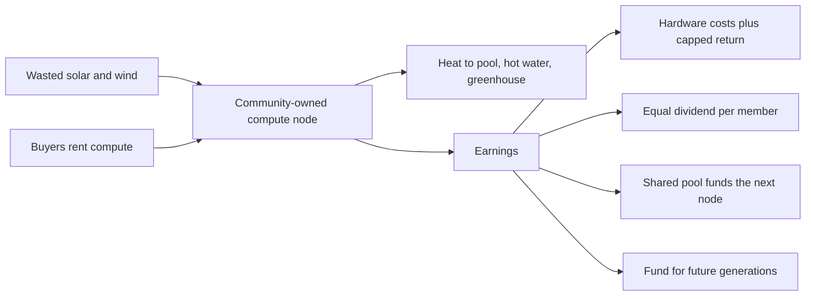

# Understory in one page

Most of what we do online now runs through a handful of enormous companies. They own the computers, the shops, the maps and the feeds. We rent access and they take a cut of everything that moves. It looks like the old system of lords and tenants, except the land is digital and the rent is invisible.

Understory is a way for ordinary people and small towns to own some of that machinery themselves, and to share what it earns.

Here is how it works. A person, a club or a town buys a modest computer rack and puts it somewhere its heat is useful: next to the town pool, in an aged care home's hot water room, behind a greenhouse. It runs on cheap or wasted solar and wind power, mostly at times the grid has too much. Businesses and researchers around the world rent that computing power, the same way they rent it from the giants, only cheaper.

The money it earns is split like this. Whoever provided the hardware gets their costs back plus a small, fixed return. Everything else is shared equally, one share per person, among everyone who is a member. You cannot buy more shares. You cannot sell yours or pass it on. If a group ends up with money sitting around unused, it flows on to help the next group build their first node.

The network itself rewards cooperation. Groups that share, maintain their machines and contribute to the common pool get sent more work. Groups that stop contributing quietly get sent less. Nobody has to argue about it; the plumbing does it.

Decisions are made by the members, with boards chosen by lot the way juries are. The people who run the machines have to publish every choice as options with costs, and the members pick. A slice of every dollar goes into a fund for people not yet born, that the members who raised it cannot spend on themselves.

Anyone can copy all of this. The documents, the software and the rules are free to take, run and change. A big company could adopt it, but they cannot fence it off, and the only way to make money from it at scale is to pay into the shared pool like everyone else.

It starts with one person and one machine. It does not need permission.

What it is not: a cryptocurrency, a startup, a charity, or a plan that only works if everyone is nice.
