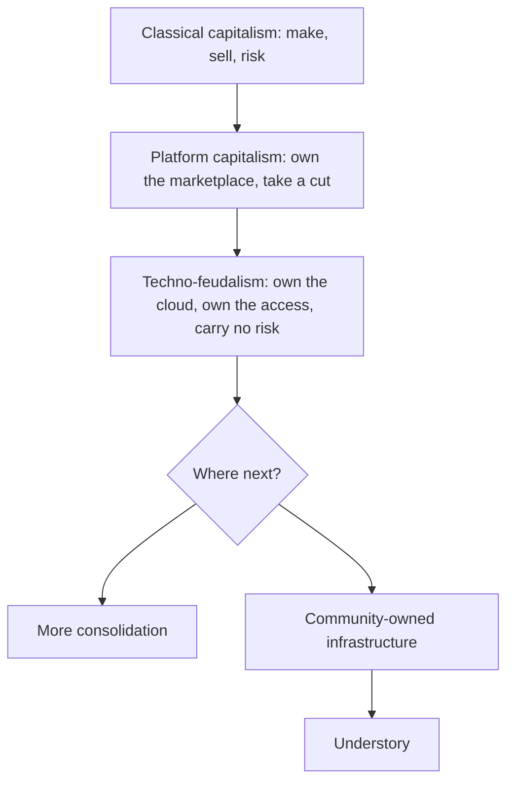

# Why now

## The short version

For a couple of centuries, the way to get rich was to make things and sell them in a market, taking the risk that nobody would buy. That is capitalism, roughly. Over the last twenty years a new way appeared: own the place where everything happens, and charge a toll. The app store takes its cut of every sale. The marketplace takes its cut of every seller. The cloud takes its cut of every business that runs on it. The owners of these places carry almost none of the risk. The people who actually make and deliver things carry all of it.

Several economists have noticed that this looks less like a market and more like the feudal system, where lords owned the land and everyone else paid to use it. They call it techno-feudalism. You do not have to accept the label to see the pattern.

## Three things worth noticing

You no longer own much. Your music, your films, your software, sometimes your tractor's ability to be repaired, are licensed. You pay to keep access. Stop paying and it vanishes.

The toll is everywhere and invisible. Roughly a third of many digital transactions goes to whoever owns the platform, before the person who did the work sees anything.

The machines are somewhere else. The computing that runs modern life sits in enormous data centres owned by a few firms, burning a great deal of energy, in places chosen for tax and land, not for community.

## Why this matters for a town

A town that runs on other people's platforms is a tenant. It pays rent in fees, in data, and in the jobs that leave. It has no say. Understory is one way for a town, or a person, to own a small piece of the machinery instead, and to share what it earns.

## Why this moment

Three things have lined up. Renewable energy is now often so abundant in the middle of the day that it gets switched off, because there is nowhere for it to go. Demand for computing, especially for AI, is enormous and growing, and buyers will rent it from anyone reliable. And the tools for running computers cooperatively across many small sites have matured enough that a competent person can set one up. Wasted energy, hungry buyers, workable tools. That is the opening.

## Further reading and watching

Books, from most accessible to least:

- Yanis Varoufakis, *Technofeudalism: What Killed Capitalism*. The idea of cloud capital and cloud rent, told for a general reader.
- Cory Doctorow's writing on "enshittification", on how platforms decay once they have you locked in. Short essays, widely available online.
- Elinor Ostrom, *Governing the Commons*. Harder going, but the evidence that ordinary people can manage shared resources without a lord or a market.
- Cédric Durand, *Techno-Feudalism: Critiquing the Digital Economy*. More academic.
- McKenzie Wark, *Capital Is Dead: Is This Something Worse?*. Provocative and short.
- Murray Bookchin, on libertarian municipalism and confederation. Start with his shorter essays.

Video: search for Varoufakis and Doctorow interviews on techno-feudalism and enshittification; both explain their ideas well on camera. For the energy side, search for explainers on renewable curtailment and negative electricity prices in Australia. A curated, checked list belongs here once someone has watched them.

For the biology and Indigenous governance that shaped the design, see Part 04.
