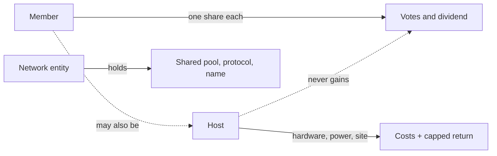

# Who owns what

Feudalism happens when the same party owns the land, runs it, and collects the money. Understory keeps those apart on purpose.

A member is a person. Every member holds exactly one share. It cannot be bought, sold, given away or inherited, and it lapses when you leave. Members vote, serve on boards when drawn by lot, and receive the dividend.

A host is whoever provides hardware, power or a site. A host might be a member, a club, a council, a school or a business. Hosts are paid their costs plus a capped return set by the assembly. Hosting does not earn extra votes or extra dividend. No single household may host more than a set share of any pool's compute.

The network entity is a legal body, a co-operative in Australia, that owns the shared pool, the protocol and the name. Its guardians are chosen by lot from across all member groups. It exists so that the commons has standing in court and so that no single group can capture it.

When you start alone, you are all three at once. That is fine for one machine. The moment a second person joins, the roles separate and the rules above apply. Part 07 covers this transition.
