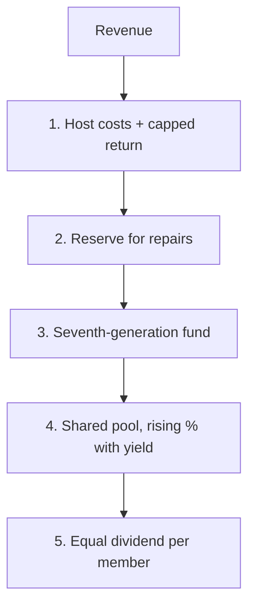

# Where the money goes

Every dollar a node earns goes down the same waterfall, in the same order, every time.

First, hosts are paid what it cost them, plus the capped return. Second, a reserve is topped up for repairs and replacement. Third, a fixed slice goes to the seventh-generation fund, which the members who raised it cannot spend on themselves. Fourth, a percentage goes to the shared pool that funds new nodes elsewhere; that percentage rises gently as a group's yield grows, so bigger groups contribute more without being punished for size. Whatever is left is the dividend, split equally per member.

## Wealth that must move

If a group leaves money in reserve beyond what repairs need, and does not distribute or reinvest it within a set period, it is swept to the shared pool automatically. Hoarding is not forbidden. It is pointless.

## Cooperation pays

Each group carries a reciprocity score. It rises when the group pays into the pool on time, keeps its nodes up, publishes its accounts and helps a new group start. It falls when it does not. The routing layer sends more work to groups with higher scores. Nobody has to argue, sanction or vote. A group that stops contributing simply earns less, and can earn it back by contributing again.

## Be honest about size

One node in one town will pay a dividend of tens or a few hundred dollars a year at first. That is not a living. It is a floor that only rises, because the rules do not allow it to be captured and the pool keeps building new nodes. Over time the network entity can hold other yield-bearing assets, shares in a solar farm, community housing, under the same equal-split rule. Compute is the first asset, not the only one.
