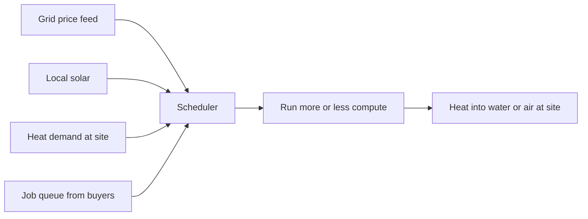

# Where the energy comes from

On a sunny afternoon in Victoria there is often more solar power than anyone can use. Prices go to zero or below and rooftop systems get switched off. That wasted power is the fuel.

A node runs hardest when power is cheapest and throttles when it is dear. The scheduler decides, minute by minute, how much work to take and where. This is a well understood problem and the first real piece of software in Understory.

Computers turn almost all their electricity into heat. Instead of paying to get rid of it, the node sits where heat is wanted: the hot water system of an aged care home, the town pool, a greenhouse, a laundry. The site gets free heat. The node gets a cheap home.

We do not pipe heat to houses. Distribution is hard, seasonal and expensive. Put the compute at the heat load, and distribute money instead.

## The honest caveat

Adding compute to the world uses energy, even cheap energy. If Understory only ever soaks up power that would otherwise be curtailed, it is close to free in environmental terms. If it starts drawing on the grid at peak to chase revenue, it becomes part of the problem. The scheduler must have a hard ceiling on grid-drawn energy that the assembly sets and the hosts cannot override. This is logged as a hand-wave until it is built and measured.
