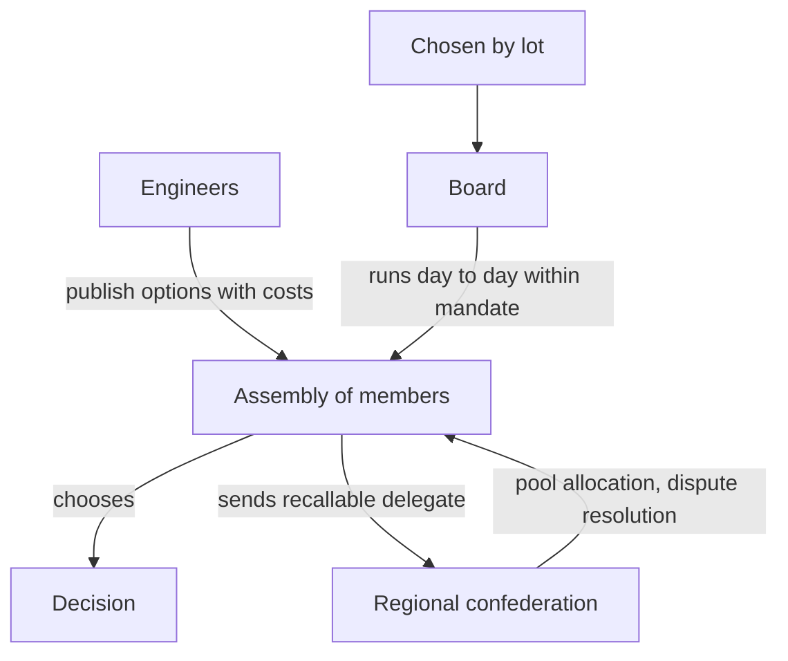

# Who decides

Small groups become petty fiefdoms in two ways: someone becomes indispensable, or someone becomes invisible. Understory refuses both.

Boards are chosen by lot from members, the way juries are, for fixed terms. Delegates to any regional level carry written mandates and can be recalled by the group that sent them.

The people who run the machines do not make policy. They publish every significant decision as a set of options with costs and risks, in plain language, and the members choose. Technical roles rotate, are paid from a budget the assembly sets, and carry a duty to document everything so anyone can take over. Anyone can run a node from the published playbook.

Anyone can leave. Your node, your data and the protocol go with you. If the network ever turns into a landlord, you fork it.

Larger towns can build larger nodes and keep most of what they earn. What they cannot do is convert size into control. Their delegate has one voice like everyone else's, and their pool contribution funds the next small town, which then adds capacity and buyers to the network they profit from.
