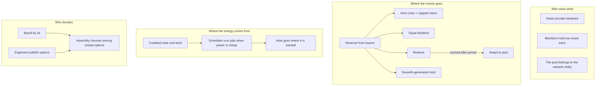

# How it works

1. [Who owns what](01-ownership.md)
2. [Where the money goes](02-money.md)
3. [Where the energy comes from](03-energy.md)
4. [Who decides](04-decisions.md)

```mermaid
flowchart TB
    subgraph Own[Who owns what]
        H[Hosts provide hardware]
        M[Members hold one share each]
        Pool[The pool belongs to the network entity]
    end
    subgraph Money[Where the money goes]
        R[Revenue from buyers] --> HC[Host costs + capped return]
        R --> Div[Equal dividend]
        R --> Res[Reserve]
        R --> Gen[Seventh-generation fund]
        Res -- unused after period --> Sweep[Swept to pool]
    end
    subgraph Energy[Where the energy comes from]
        Sun[Curtailed solar and wind] --> Sched[Scheduler runs jobs when power is cheap]
        Sched --> Heat[Heat goes where it is wanted]
    end
    subgraph Decide[Who decides]
        Lot[Board by lot] --> Ass[Assembly chooses among costed options]
        Eng[Engineers publish options] --> Ass
    end
```
