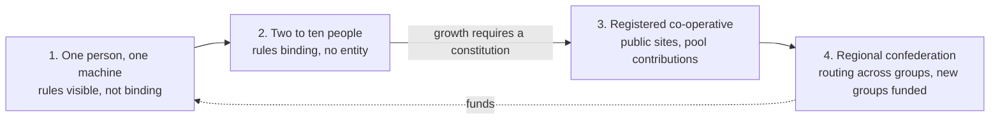
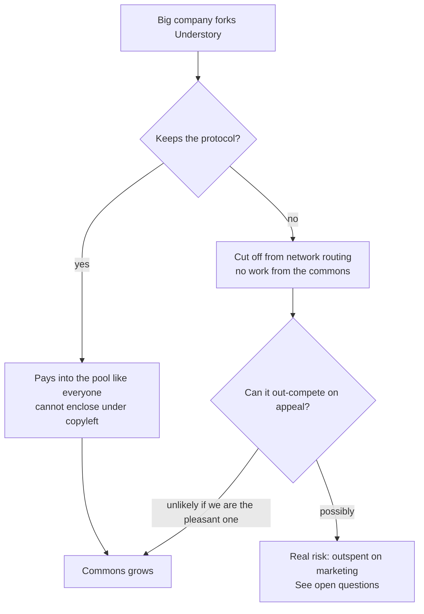

# The pathway

We cannot assume a town will pick this up. Towns are slow, councils are cautious, and most people have never heard of a co-operative. So Understory must work for one person with one machine, spread from that person to the next, and only take on the shape of a town when a town is ready. The shape stays open. The rules travel with the code.

## Stage one: one person, one machine

A person installs the node software on ordinary hardware they already own or can afford, a second-hand GPU box, a mini PC, a server from a decommissioned office. They point it at their rooftop solar, or just at cheap overnight power. They sell compute through the buyer-facing API. At this stage they are member, host and entity all at once. Nothing stops them keeping every dollar. What the software does is keep the books as if the rules already applied: it shows them what the host share, the reserve, the seventh-generation slice, the pool share and the dividend would have been. The rules are visible before they are binding.

## Stage two: two to ten people

The moment a second person joins, the roles split and the waterfall becomes real. The software creates a group, records one share each, and starts paying the equal dividend. There is still no legal entity, no council, no assembly beyond a group chat. This is the window where petty feudalism is most likely, so the design does three things: the founder's node has no special rights in the code, every member can export the ledger and leave with their share of the reserve, and the group cannot exceed a size limit until it has adopted a written constitution from the playbook. That last one is the ratchet: growth requires formalising, and formalising removes the founder's privilege.

## Stage three: a group becomes a body

Once a group is big enough to register as a co-operative, it does, using the templates in Part 08. It joins the network entity, its reciprocity score starts counting, and its pool contributions begin. Now it can host at a public site, a pool, a school, a hall, because it has a legal body that can sign a lease.

## Stage four: bodies confederate

Groups in a region send recallable delegates, pool allocations fund new groups, and partner-choice routing turns on across groups. This is the town-scale picture from Part 03, arrived at from below rather than imposed.

## Covertly distributable

This means three things, all of which the software must satisfy.

Self-contained, no central server. The entire stack, node software, ledger, scheduler and buyer API, runs from a single repository on one machine. There is no Understory server anyone must register with, including one run by the founders. Discovery between groups uses open peer-to-peer mechanisms and can fall back to a person typing in a friend's address.

Runs quietly on ordinary hardware. No special equipment, no data-centre grade anything to begin. A node should run on a machine a plumber could buy second-hand and plug in under a bench, and should draw only as much attention as any home server does.

Spreads person to person. The unit of adoption is a person telling another person, sending them the repo, and helping them plug in. The playbook is written for that conversation. Every node ships with the full documentation inside it, so a copy of the software is a copy of the idea.

## Defending against big tech

The threat is not that a large company attacks Understory. It is that they adopt it, add a convenient app, and become the door everyone walks through. That is how every open thing has been enclosed. The defence has three layers.

Openness makes enclosure pointless. Copyleft licensing means anyone offering the software as a service must publish their version. There is no proprietary edge to build. A company that improves it improves it for everyone.

Reciprocity makes enclosure unprofitable. The routing layer and the pool rules are part of the protocol. A fork that removes them is no longer speaking the protocol and gets no work from the network. A fork that keeps them pays into the pool like everyone else. The only way to profit at scale is to feed the commons.

Appeal makes enclosure unnecessary. If the community version is the pleasant one, with the honest dividend, the local heat, the neighbour who helped you set it up, the convenient corporate version has nothing to offer that people want. The strategy is not to hide. It is to be the thing people would rather have. Design and hospitality are defensive weapons here, which is why the one-pager and the playbook matter as much as the scheduler.

## What still needs thinking

Each of these deserves a session of combined human and LLM work, and probably outside expertise.

The trusted-founder window. In stage one and early stage two, whoever runs the code is trusted. The size-limit ratchet shortens this but does not close it. Think about whether the ledger can be made tamper-evident from the first day, and whether a second person joining should automatically require a third-party-verifiable ledger.

Discovery without a chokepoint. Groups need to find each other and buyers need to find groups. A directory is a chokepoint. Think about gossip protocols, existing federated identity, and whether a directory can be made harmlessly forkable.

The marketing threat. A company that complies with the licence, keeps the protocol, pays into the pool and still wins on marketing is not obviously bad, since the pool grows. But it could make the network dependent on its buyer volume. Think about concentration limits on buyers as well as hosts.

Quiet versus appealing. Being unobtrusive and being attractive may be phases rather than a contradiction: quiet while small and fragile, loud once the rules are binding and the entity exists. Decide when the switch flips.

Legal shape of a stage-two group. An unincorporated group paying dividends has tax and liability questions. Find the lightest Australian structure that fits, or accept that stage two must be short.
