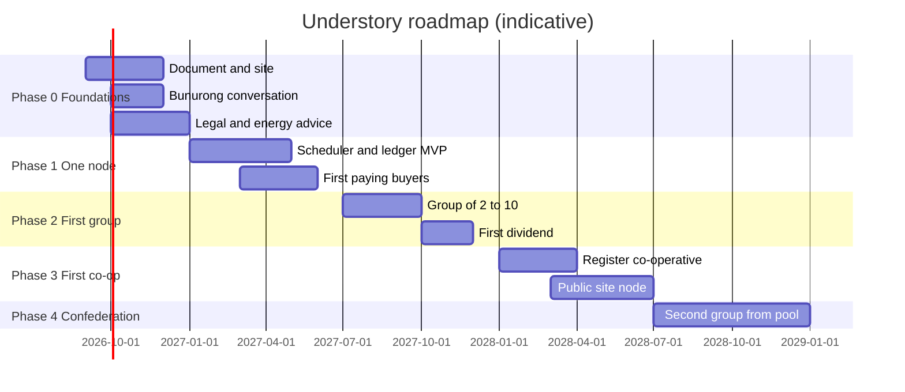

# Roadmap and plan

Phase 0, to end 2026: this document and site published; name settled; conversation with the Bunurong Land Council; legal and energy expert conversations; one candidate site conversation on the Peninsula. Exit: register updated with expert findings.

Phase 1, first half 2027: scheduler and ledger MVP; one node on one person's hardware selling real compute; books kept as if rules applied. Exit: three paying buyers, one month of metered energy data.

Phase 2, second half 2027: a stage-two group of two to ten; first equal dividend paid, however small; constitution adopted. Exit: a dividend has been paid and the ledger exported by a member.

Phase 3, 2028: co-operative registered; node at a public heat-load site; pool contributions begin. Exit: a second group funded from the pool.

Phase 4, 2028 onward: regional confederation, partner-choice routing across groups, network entity with guardians by lot.

