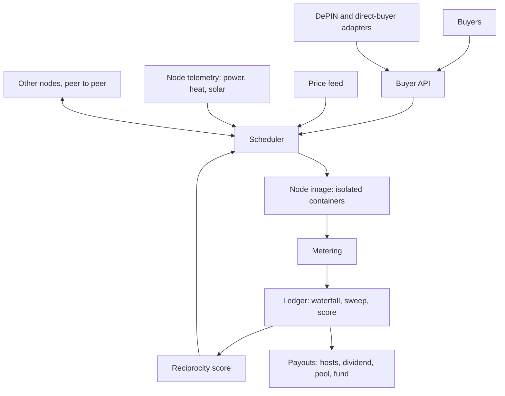

# Architecture

Components: the node image (container runtime, metering, heat and power telemetry); the scheduler (takes price, solar, heat demand, job queue and reciprocity score, decides what to run); the ledger (append-only, tamper-evident, implements the waterfall, the sweep and the reciprocity score); the buyer API (a plain compute-rental endpoint that hides everything else); adapters (interchangeable connections to DePIN networks and direct buyers). Discovery is peer-to-peer with a manual fallback.

